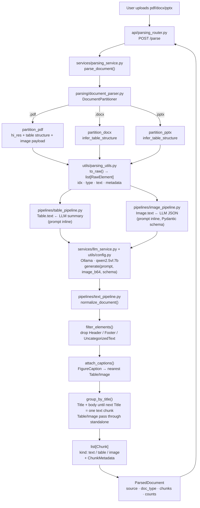
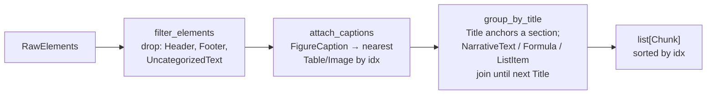

# Document Parsing Pipeline

Parse PDF, DOCX, and PPTX into embedding-ready chunks for RAG — text, tables, and images normalized into one ordered stream. Built on [unstructured](https://docs.unstructured.io) for partitioning and [Ollama](https://ollama.com) (`qwen2.5vl:7b`) for table/image enrichment.

## Architecture



## Core Ideology

One document → **one ordered stream**, not three separate buckets.

The moment you split elements into `tables = [...]`, `images = [...]`, `texts = [...]`, a table loses its heading, its lead-in sentence, and its page neighbours. Retrieval then returns a naked HTML grid with no idea what it's a table *of*. Reading order (`idx`) is the context — it is preserved end to end.

```
PDF page 3
 ├─ Title          "Q3 Revenue"           ← context for the table
 ├─ NarrativeText  "Revenue grew 12%..."  ← context for the table
 ├─ Table          <html>…</html>         ← stays downstream of the two above
 ├─ NarrativeText  "The decline in APAC…"
 └─ Image          [b64] + caption        ← belongs where it sits
```

## Pipeline Stages

### 1. Partition (`parsing/document_parser.py`)

`DocumentPartitioner` — one class, three strategies, dispatched by file suffix.

| Format | Function | Key args |
|---|---|---|
| `.pdf` | `partition_pdf` | `strategy="hi_res"`, `infer_table_structure=True`, `extract_image_block_types=["Image","Table"]`, `extract_image_block_to_payload=True` |
| `.docx` | `partition_docx` | `infer_table_structure=True` |
| `.pptx` | `partition_pptx` | `infer_table_structure=True` |

Raw partition only — nothing collapsed, nothing dropped, order preserved. Output is `list[RawElement]`:

```python
class RawElement(BaseModel):
    idx: int                        # reading order — ours, not unstructured's
    type: str                       # el.category: "Table", "Image", "NarrativeText", ...
    element_id: str
    text: str = ""
    metadata: ElementMetadata        # page_number, text_as_html, image_base64, filename, ...
```

> `hi_res` is required for Table/Image detection in PDFs. DOCX/PPTX have no hi_res path; tables come as HTML for free, images only surface if embedded as picture shapes.

### 2. Table Enrichment (`pipelines/table_pipeline.py`)

For every `Table` element: `metadata.text_as_html` → LLM → dense prose summary written into `.text`. The HTML stays untouched as source of truth (the raw extracted `text` on tables is junk — numbers run together, no row boundaries — and is deliberately discarded).

The prompt (`TABLE_PROMPT_TEMPLATE`, defined inline in this module) forces: subject, row/column structure, **named standout values with labels attached**, and a no-fabrication rule (every cited number must appear in the table verbatim).

### 3. Image Enrichment (`pipelines/image_pipeline.py`)

For every `Image`/`Figure` element with an `image_base64` payload: base64 → vision LLM → JSON written into `.text`, matching unstructured's own [image-descriptions](https://docs.unstructured.io/concepts/enriching/image-descriptions) convention.

Enrichment goes through Ollama's **structured outputs**, not prompt-and-hope: `generate()` accepts a `schema: type[BaseModel]` and passes `format=schema.model_json_schema()` to `ollama.Client.chat()`, which constrains decoding to that shape. The schema in use:

```python
class ImageDescription(BaseModel):
    type: str
    description: str
```

```json
{"type": "graph", "description": "Line graph of F-Measures vs number of features..."}
```

`el.text` is set from `ImageDescription.model_validate_json(raw)`. A `ValidationError` (Ollama still can't guarantee 100% conformance) falls back to `{"type": "unknown", "description": raw}` instead of crashing the batch.

> **Known gap:** the prompt (`IMAGE_PROMPT`) also asks the model to return a `text_in_image` field, but `ImageDescription` only declares `type` and `description` — the schema constrains the model to just those two keys, so `text_in_image` is requested and silently discarded. Either drop it from the prompt or add it to the schema.

### 4. Text Normalization (`pipelines/text_pipeline.py`)

Three passes, in order:



**Grouping rule:** a `Title` starts a section; every `NarrativeText`/`Formula`/`ListItem` after it joins that section until the next `Title`. Edge cases handled explicitly:

- Body text **before the first Title** → still becomes a chunk (`title=None`), not dropped
- Doc **ends mid-section** → final `flush()` catches it
- `Table`/`Image` interrupt a section → section flushes, table/image passes through as its own standalone chunk (they are always embedded separately)

**Caption rule:** each `FigureCaption` is prepended into the text of the nearest `Table`/`Image` by `idx` distance, then removed from the stream — captions are gold retrieval context and shouldn't get buried in narrative prose.

> **Known bug:** `parse_document()` in `services/parsing_service.py` runs `describe_tables()`/`describe_images()` (LLM enrichment) **before** `normalize_document()` (which does caption attachment). So a caption gets prepended *after* `el.text` has already been overwritten with the LLM's output. For tables this just glues a sentence in front of prose. For images it's worse: the caption string gets prepended onto what is otherwise a clean JSON payload, so `Chunk.text` for a captioned image is `"<caption>\n\n{\"type\": ..., \"description\": ...}"` — no longer valid JSON on its own, breaking the contract described below. Fix is to either attach captions before enrichment, or attach them to a separate field instead of `.text`.

### 5. Output Schema

```python
class Chunk(BaseModel):
    kind: str                  # "text" | "table" | "image"
    idx: int                   # anchor position, reading order preserved
    title: str | None          # section heading (text chunks)
    text: str                  # prose / LLM table summary / LLM image JSON*
    metadata: ChunkMetadata

class ChunkMetadata(BaseModel):
    filename: str | None
    page_number: int | None
    pages: list[int]           # text chunks spanning multiple pages
    element_ids: list[str]     # audit trail back to raw partition
    text_as_html: str | None   # table only — original data survives here
    image_base64: str | None   # image only
    image_mime_type: str | None

class ParsedDocument(BaseModel):
    source: str                # user's original filename
    doc_type: str              # pdf | docx | pptx
    chunks: list[Chunk]
    counts: dict[str, int]     # raw partition category counts (diagnostic, pre-filter)
```

\* see the caption-ordering bug above — image `text` is only guaranteed-parseable JSON when the image has no attached caption.

## API

```
POST /parse          multipart file upload (.pdf / .docx / .pptx, ≤ 50 MB)
→ ParsedDocument (JSON)
```

```bash
uvicorn main:app --reload
curl -F "file=@sample.pdf" localhost:8000/parse | jq '.doc_type, .counts'
# or use the Swagger UI at http://localhost:8000/docs
```

## Logging

Every layer logs through `logging.getLogger(__name__)`; `main.py` calls `logging.basicConfig(level=logging.INFO)` at import time so it all reaches stdout without extra setup. Per request you'll see: partition result (element count), how many tables/images qualify for enrichment, an `element_id`-tagged line before each LLM call, the Ollama call itself (model, prompt length, image/schema flags) from `llm_service.generate()`, response length, and a final summary of chunk/category counts from `parsing_service.parse_document()`.

## Project Layout

```
backend/
├── main.py                          # FastAPI app + logging.basicConfig
├── requirements.txt
├── resource_normalization.py        # legacy multi-parser orchestrator — not imported by main.py
├── api/
│   └── parsing_router.py            # POST /parse
├── parsing/
│   ├── document_parser.py           # DocumentPartitioner
│   └── web_parser.py                # crawl4ai-based URL parser — not wired into the API yet
├── pipelines/
│   ├── table_pipeline.py            # Table.text ← LLM summary (prompt inline)
│   ├── image_pipeline.py            # Image.text ← LLM JSON (prompt + schema inline)
│   └── text_pipeline.py             # filter → captions → title grouping → Chunk
├── services/
│   ├── llm_service.py               # generate(prompt, image_b64=None, schema=None) → Ollama
│   └── parsing_service.py           # orchestrator: parse_document()
└── utils/
    ├── config.py                    # OLLAMA_HOST, OLLAMA_MODEL
    └── parsing_utils.py             # RawElement, ElementMetadata, to_raw(), insight()
```

## Setup

```bash
pip install -r requirements.txt

# macOS
brew install poppler tesseract
# Linux / Docker
apt-get install -y poppler-utils tesseract-ocr libgl1

ollama pull qwen2.5vl:7b
```

`requirements.txt` also still carries `crawl4ai`, `langchain-text-splitters`, `langdetect`, `nltk`, `tiktoken`, and `pillow` — leftovers from an earlier chunking implementation and the not-yet-wired `web_parser.py`. None of them are imported by the live `/parse` path; safe to prune if you're not using `web_parser.py`.

## Known Limitations / Open Items

- **Sync + CPU-bound** — a `hi_res` PDF blocks the worker for seconds; each table/image is a blocking LLM round-trip. Fine for a demo endpoint; production wants `202 + job_id` and a task queue, plus batched/async LLM calls.
- **Caption attachment runs after LLM enrichment** (see Stage 4) — breaks the JSON-parseability guarantee on captioned image chunks.
- **`text_in_image` requested but not captured** (see Stage 3) — prompt/schema mismatch in `image_pipeline.py`.
- **Paragraphs split across page breaks** are not stitched back together — `partition` emits them as separate elements, and unlike the old chunker, `group_by_title` currently has no overlap/stitching mitigation.
- **Consecutive Titles** (heading immediately followed by subheading) produce a title-only chunk — merge behavior undecided.
- **Base64 images ride in the JSON response** — payload gets fat fast; swap to `extract_image_block_output_dir` when it hurts.
- Table HTML from `hi_res` is structurally noisy on complex financial tables (`$` in its own cell, phantom rowspans) — that's the ceiling of TableFormer, not a pipeline bug; the LLM summary absorbs most of it.
- `parsing/web_parser.py` and `resource_normalization.py` exist in the tree but aren't reachable from `main.py` — either wire them in or remove them.
- Nothing downstream of `list[Chunk]` exists yet: no embedding, no vector store, no retrieval.
